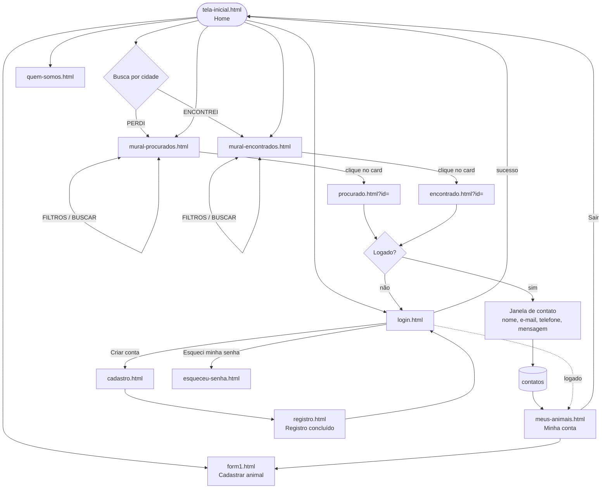
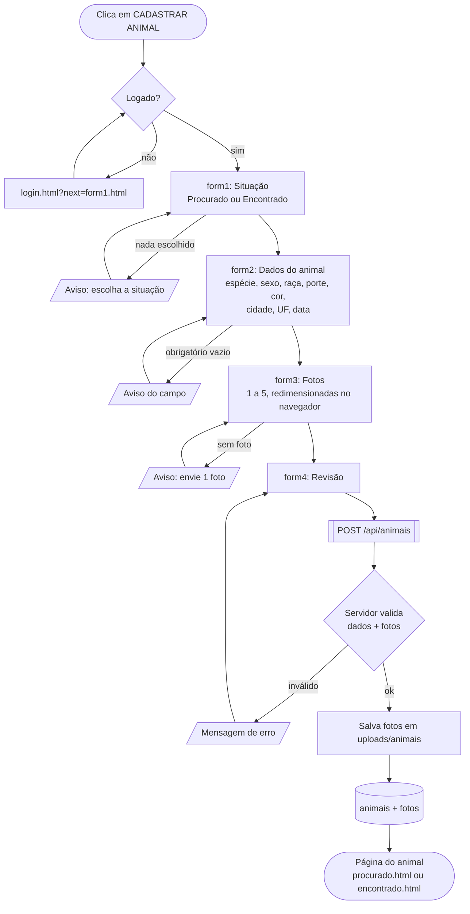
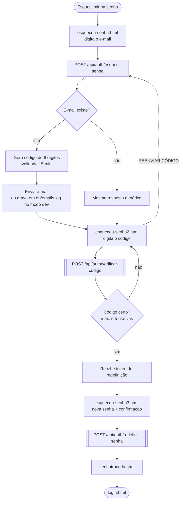
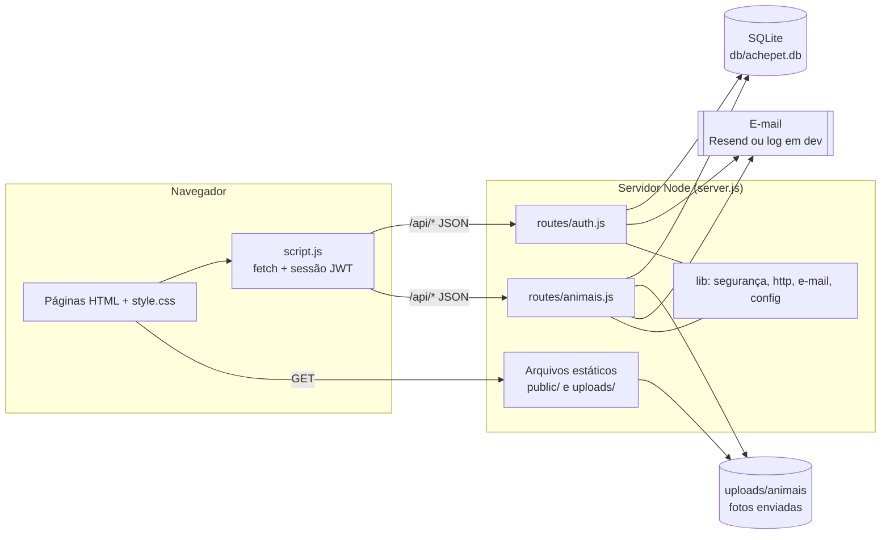
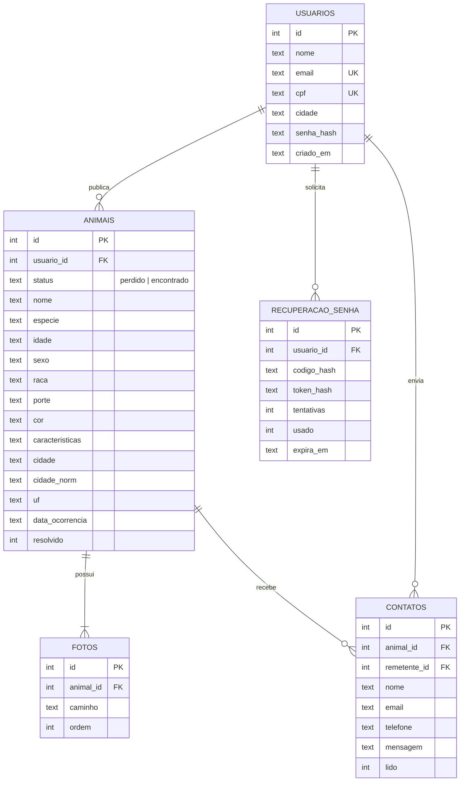

# AchePet — Fluxogramas

> Para visualizar: abra este arquivo no VS Code (extensão "Markdown Preview Mermaid Support"),
> no GitHub, ou cole cada bloco em https://mermaid.live

## 1. Navegação geral do site

## 2. Cadastro do animal (form1 → form4)

## 3. Recuperação de senha

## 4. Arquitetura

## 5. Banco de dados (modelo)

